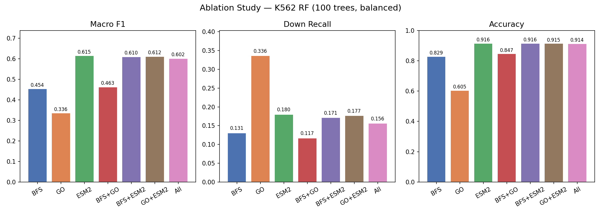
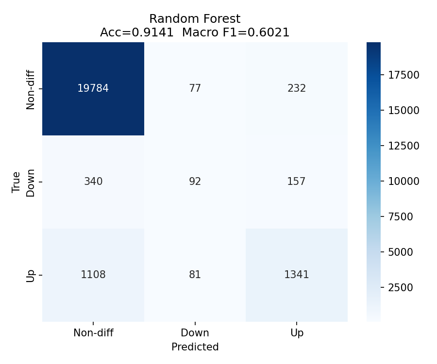
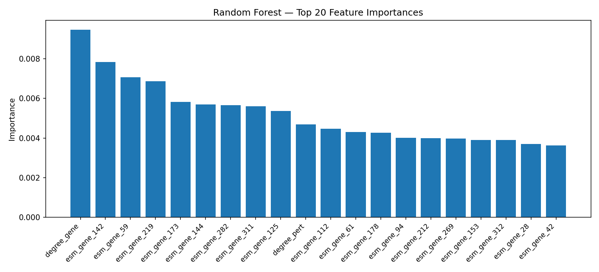

# Cancer Gene Perturbation Effect Prediction

A lightweight multimodal classifier that predicts whether a downstream target gene is **Up-regulated**, **Down-regulated**, or **Non-differential** after knocking out a cancer driver gene in human cancer cell lines.

**[View Interactive Results →](https://ian4681.github.io/multimodal-gene-perturbation/)**

---

## Key Results

| Model | Accuracy | Macro F1 |
|---|---|---|
| Random Forest (full features) | **91.4%** | **0.60** |
| Logistic Regression | 73.2% | 0.36 |
| 2-layer GAT (GNN) | 70.1% | 0.43 |

**Cross-cell-line generalization** — trained on K562, evaluated on three unseen cell lines:

| Cell Line | Macro F1 |
|---|---|
| HepG2 | 0.49 |
| Jurkat | 0.53 |
| RPE1 | 0.51 |

---

## Feature Engineering (649 dimensions total)

| Feature Group | Dims | Source |
|---|---|---|
| BFS path features (shortest path, degree, neighbor overlap) | 5 | STRING gene interaction graph |
| GO term shared annotations (BP / MF / CC) | 4 | Gene Ontology |
| ESM-2 8M protein embeddings (perturbed gene + target gene) | 640 | ESM-2, Lin et al. 2023 |

### Key finding from ablation study

ESM-2 features alone achieve F1=0.615, nearly matching the full 649-dim model. BFS network topology and GO functional annotation add minimal signal, suggesting protein sequence information is the primary discriminative factor for predicting perturbation direction.



---

## Pipeline

```
PerturbQA cell line data (K562/HepG2/Jurkat/RPE1)
        │
        ├─── Gene interaction graph (STRING, 18,479 nodes)
        │         └─→ BFS path features (5 dims per gene pair)
        │
        ├─── Gene Ontology annotations (goa_human.gaf)
        │         └─→ Shared GO term counts (4 dims)
        │
        └─── UniProt human protein sequences
                  └─→ ESM-2 8M embeddings (320 dims × 2 genes = 640)
                            │
                            ▼
              Feature fusion → 649-dim vector per (pert, target) pair
                            │
                            ▼
               Random Forest (100 trees, class_weight='balanced')
                            │
                            ▼
              Prediction: Up / Down / Non-differential
```

---

## Confusion Matrix (Random Forest, K562 test set)



## Feature Importance (Top 20)



---

## Setup

```bash
conda create -n perturb python=3.9
conda activate perturb

# PyTorch (CPU)
pip install torch==2.0.1+cpu --index-url https://download.pytorch.org/whl/cpu
pip install torch_geometric

# Analysis packages
pip install pandas numpy scikit-learn matplotlib seaborn joblib
pip install fair-esm transformers goatools networkx
```

---

## Usage

**1. Set `BASE_DIR`** at the top of each script to your project root directory.

**2. Required data** (from [AROMA repository](https://github.com/Mathbiomed/AROMA)):
- `raw_data/data/PerturbQA/K562.csv` (and HepG2/Jurkat/RPE1 for cross-cell-line)
- `raw_data/data/Knowledge_Graph/gene_graph.pth`
- `raw_data/go/go-basic.obo` and `raw_data/go/goa_human.gaf.gz`
- `raw_data/uniprot_human.fasta.gz`
- `models/esm2_8M/` (facebook/esm2_t6_8M_UR50D, downloaded locally)

**3. Run scripts in order:**

```bash
python scripts/extract_bfs_features.py    # ~70s  → features/bfs_features_K562.pkl
python scripts/extract_go_features.py     # ~12s  → features/go_features_K562.pkl
python scripts/extract_esm2_features.py   # ~690s → features/esm2_embeddings.pkl
python scripts/extract_merge_train.py     # trains RF + LR, saves confusion matrices
python scripts/ablation_study.py          # 7-combination feature ablation
python scripts/cross_cellline_eval.py     # cross-cell-line generalization
python scripts/gnn_train.py               # optional: 2-layer GAT baseline
```

---

## Data Sources

- **PerturbQA** (perturbation data): [AROMA, Wang et al. 2026](https://github.com/Mathbiomed/AROMA)
- **Gene interaction graph**: Pre-built from STRING database, distributed with AROMA
- **Gene Ontology**: [geneontology.org](https://geneontology.org)
- **Protein sequences**: [UniProt human proteome](https://www.uniprot.org)
- **ESM-2**: [facebook/esm2_t6_8M_UR50D](https://huggingface.co/facebook/esm2_t6_8M_UR50D)

## References

1. Wang et al. (2026). AROMA: Towards Reasoning-centric Omics Modeling and Analysis. Tencent AI Lab.
2. Chen & Zou (2024). GenePT: Using Large Language Model GPT as a Foundation Model for Gene Expression Prediction. *Nature Methods*.
3. Lin et al. (2023). Evolutionary-scale prediction of atomic-level protein structure with a language model. *Science*, 379(6637), 1123–1130.
